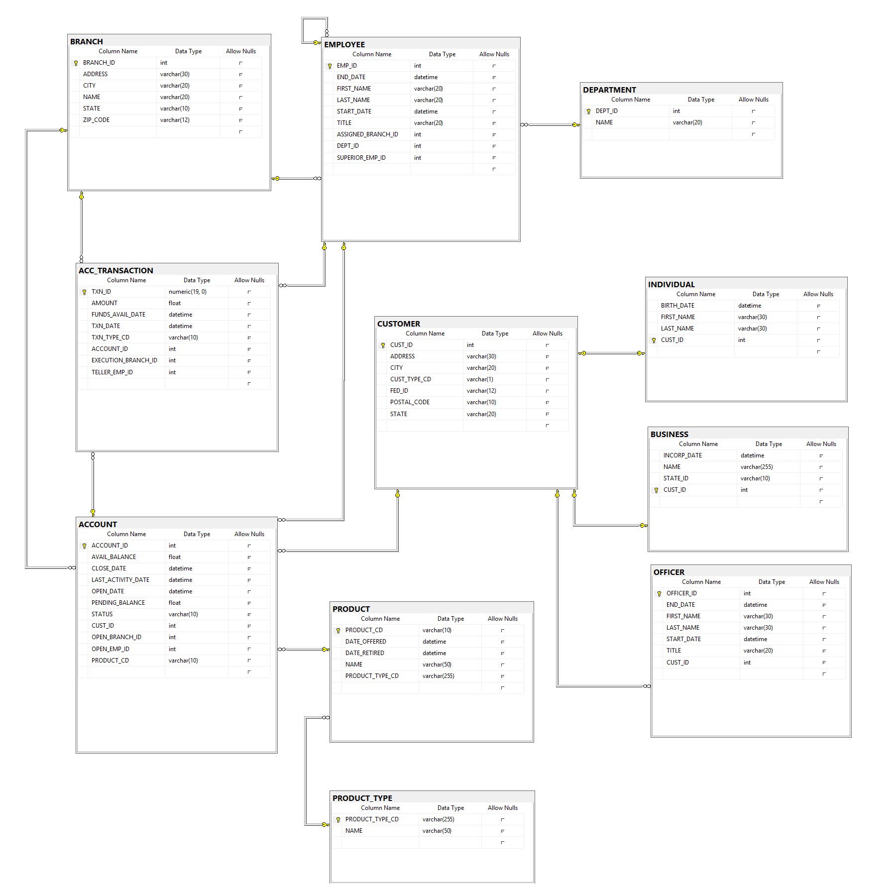

# Interactive Banking Exercise

### Description
* For this interactive class exercises, we will ask questions about the [Banking database](./mariadb-banking-schema.png) document, then devise queries to answer those questions.

1. For each product, show the product name `Product` and the product type name `Type`.

2. For each `branch`, list the branch `name` and `city`, plus `lastName` and `title` of each `Employee` who works in that `branch`.

3. Show a list of each _unique_ employee `title`.

4. Show the `lastName` and `title` of each `Employee`, along with the `lastName` and `title` of that `Employee`'s boss.

5. For each `Account`, show the `name` of the account's product, the `availableBalance`, and the `Customer`'s `lastName`.

6. List all account transaction details for individual `Customer`s whose `lastName`` starts with `T`.